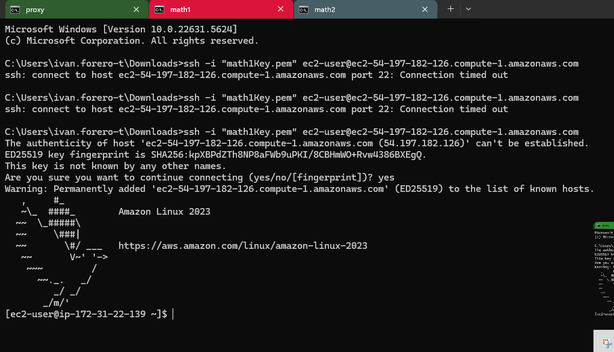

# Segundo Parcial Ivan F Torres
# Enunciado
**Conjetura de Collatz:**

La conjetura de Collatz dice que si usted crea una secuencia de números, a partir de cualquier entero positivo, siguiendo las reglas descritas abajo, siempre la secuencia terminará en le número 1. Esta conjetura aún no se ha demostrado.
 
Las reglas son:
- f(n)=n/2 si n es par.
- f(n)=3n+1 si n es impar.

La secuencia se construye a partir de un número dado k así:
- a0=k
- ai=f(ai−1)

Por ejemplo, dato el número k=13 la secuencia sería:
**13→40→20→10→5→16→8→4→2→1**
# Arquitectura
Para la arquitectura tenemos lo siguiente:

# Funcionamiento del algoritmo

# Grupos de seguridad de la instancia:
- Grupo de seguridad math:

- Grupo de seguridad proxy:

# Conexion a la instancia:

# Comandos utilizados
Nos conectamos mediante ssh, tener en cuenta de guardar las .pem:

- sudo dnf upgrade -y = Actualizar paquetes
- sudo dnf install maven = Instalar maven
- sudo dnf install -y git = Instalar git
- sudo dnf install java-17-amazon-corretto = Instalar java

# Verificamos versiones de java y maven, ambas deben tener java 17:

